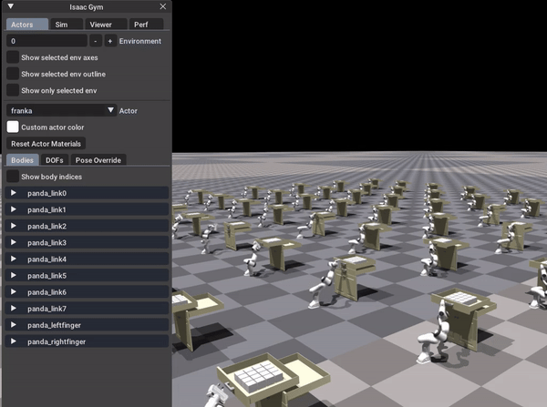
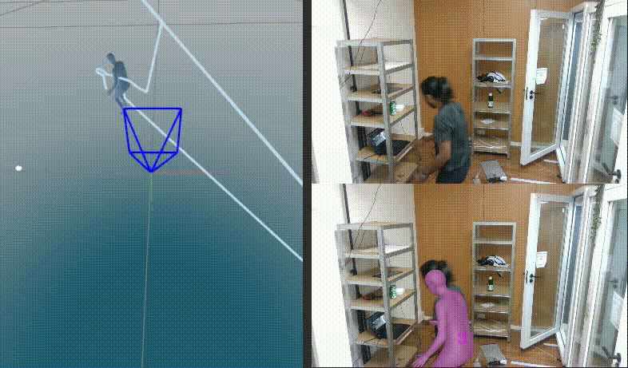
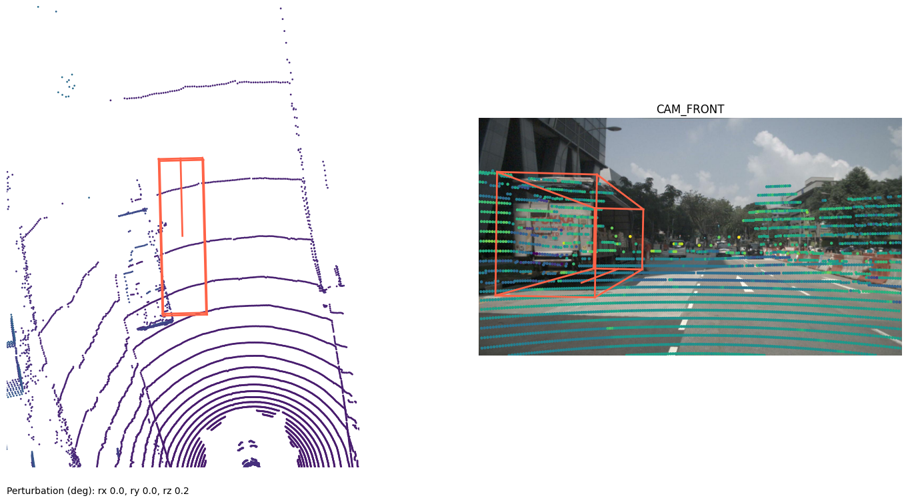

> 5 years of experience in the automotive industry, specializing in computer vision and robotics, possess strong proficiency in utilizing ROS, Python,
C++, Git, and Docker to develop and deploy cutting‑edge solutions. Expertise lies in multi‑modal sensor fusion and multi‑sensor calibration.

## Professional Experience

### Senior Software Engineer - Bosch

- Led a team of three in developing a ROS‑based LiDAR‑Camera calibration package: This included implementing 3D checkerboard detection in
point clouds, ground plane separation, normal estimation, and point cloud densification.
- Intensity‑based automatic Lidar‑Camera calibration for internal Bosch Lidar sensor
- Developed the base code for checkerboard detection algorithm and automatic 3D correspondence
- Benchmarked PointPillar‑based 3D object detection for sparse radar point clouds against a Bayesian object detector, evaluating performance
metrics and accuracy.

## Education

### Msc. in Autonomous Systems
- Established foundations for robot perception, navigation, and manipulation by leveraging deep learning and implementing state‑of‑the‑art
algorithms on physical robots, with a focus on multi‑sensor fusion and 3D object detection.
- Thesis on studying the effects of calibration on perception tasks for autonomous driving. Benchmarking multi‑modal 3D object detection meth‑
ods, including TransFusion, BEVFusion, and MVXNet, on multiple AD datasets (KITTI, NuScenes, Waymo) using MMDetection3D for comparative
analysis of performance.
- Conducted perturbation experiments to evaluate the robustness of 3D object detection algorithms against extrinsic calibration errors, enhanc‑
ing the reliability of detection systems in real‑world scenarios.
- Developed a custom Isaac Gym environment for the HSR and Kinova arm to perform cabinet‑opening tasks, and trained a reinforcement learning
agent using PPO, achieving effective results with a training time of less than 1 hour.
- Generated synthetic datasets for 6D pose detection using BlenderProc2, enabling photorealistic rendering and improving the accuracy of deep
learning models for robotics.

### BTech. in Electrical and Electronics Engineering

- An Aggregate of 80.09%. Scored the highest marks for the final‑year project and ranked second in the department

## Internship and Research Assistant

### AVL Software and Functions GmbH - _Jan 2024_

- Performed LiDAR‑LiDAR calibration using various Iterative Closest Point (ICP) methods, including point‑to‑point, point‑to‑plane, and symmetric
ICP, and benchmarked these techniques on AVL datasets.
- Utilized Open3D for 3D point cloud processing, including chamfer distance calculation and animation visualization, to enhance data analysis
and representation.
- Implemented unit tests and integrated GitHub Actions for automated testing and continuous integration, improving code
reliability and development workflow.

### University of Bonn - _Sep 2023_

- Conduct experiments and calibration for precise 3D pose estimation using OptiTrack system for multi‑agent reinforcement learning
- Implementation of papers for benchmarking the research work in visual pick and place tasks
- Porting various C++ legacy code into python code base using pybind11
- Building Docker images with GPU support and camera interfaces
- Implemented the perception stack for 3D person detection using Haselich’s clustering and localization Unitree GO1 robot using particle filters

### Livello GmbH - _Jun 2023_

- Responsible for developing computer vision module for Re‑identification of people tracking for smart autonomous checkout system
- Overhead person tracking with pose estimation from multiple camera setup
- Real‑time video stitching for person tracking, multiple camera calibration and 3D reconstruction

## Projects

##### Lidar-Camera Calibration | [Link to repo](https://github.com/Barath19/CaLiB)

##### Robot Learning | [Link to repo](https://github.com/Barath19/robotlearning-2024)

##### Primitive Ramping Behavior | [Link to repo](https://github.com/HBRS-SDP/ss22-motion-primitive-freddy?tab=readme-ov-file)

##### 3D Person Tracking Using SMPL 

##### Thesis: A Study on the Effect of Calibration Quality on Multi-Modal Perception Tasks for Autonomous Driving | [Link to repo](https://github.com/Barath19/ECPT)

## Publications

##### Reactive Correction of Object Placement Errors for Robotic Arrangement Tasks | _18th international conference on Intelligent Autonomous Systems (IAS18 ‑ 2023)_ | [Link to Paper](https://arxiv.org/abs/2302.07795)
